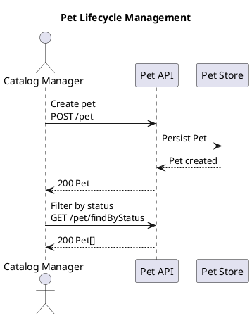

# Project 3. AI Feature Review ChatGPT App

## Краткое позиционирование

**AI Feature Review App** - ChatGPT App для Business/System Analysts, QA Engineers, Product Managers и Architects, который проверяет согласованность feature documentation на базе `docs/raw_data`.

Приложение работает не как "AI-редактор файлов", а как **review cockpit**:

- показывает список features из synthetic product docs;
- по выбранной feature собирает user story, acceptance criteria, incidents и релевантный OpenAPI slice;
- подгружает feature-level UML diagrams из `raw_data` и красиво рендерит их в React widget;
- не возвращает весь `openapi.yaml`, а вытаскивает только нужные endpoints, schemas, responses и security requirements;
- запускает deterministic consistency checks;
- возвращает structured context и rule findings в ChatGPT, чтобы сама модель ChatGPT объяснила gaps, risks, missing tests и stakeholder questions;
- показывает результат в ChatGPT widget как structured workspace.

Главный pivot:

```text
Было: ChatGPT App, который пытается редактировать документацию.
Стало: ChatGPT App, который помогает понять качество feature documentation и подготовить actionable review.
```

Это убирает ощущение "app ради app". ChatGPT App нужен не как замена IDE/Codex, а как conversational и визуальный слой для анализа продуктовой документации, где пользователю важно быстро понять:

- какие API endpoints относятся к feature;
- как выглядит feature flow на UML-диаграмме;
- покрыты ли они user story и acceptance criteria;
- какие incidents указывают на missing regression tests;
- какие business/API rules не отражены в AC;
- какие вопросы надо задать BA/QA/Architect;
- что нужно передать в Codex/GitHub agent, если позже надо менять файлы.

## Основа проекта в `docs/raw_data`

Текущий dataset уже подходит для MVP.

```text
docs/raw_data/
  openapi.yaml
  synthetic_product_docs/
    README.md
    manifest.json
    user_stories/
      us_pet_lifecycle_management.md
      us_store_order_checkout.md
      us_user_account_access.md
      us_pet_image_upload.md
    acceptance_criteria/
      ac_pet_lifecycle_management.md
      ac_store_order_checkout.md
      ac_user_account_access.md
      ac_pet_image_upload.md
    incidents/
      inc_pet_status_filter_mismatch.md
      inc_order_id_boundary_confusion.md
      inc_login_header_contract_regression.md
    diagrams/
      pet_lifecycle_sequence.puml
      store_order_checkout_sequence.puml
      user_account_access_sequence.puml
      pet_image_upload_sequence.puml
```

`manifest.json` - центральная связка между product docs и OpenAPI. В нем уже есть:

- `document_id`;
- `artifact_type`;
- `domain`;
- path к markdown artifact;
- related OpenAPI operation IDs;
- related diagram IDs;
- links от acceptance criteria к user story;
- incidents, связанные с OpenAPI operations.

Diagram artifacts добавляются как PlantUML source files (`.puml`). MVP использует sequence diagrams, потому что они лучше всего связывают user story, API operations и test scenarios. Позже можно добавить activity/component diagrams.

Примеры features для первого UI:

| Feature | Domain | User Story | Related Operations | Diagram | Incidents |
| --- | --- | --- | --- | --- | --- |
| Pet Lifecycle Management | pet | `us_pet_lifecycle_management_v1` | `addPet`, `updatePet`, `getPetById`, `findPetsByStatus`, `deletePet` | `diag_pet_lifecycle_sequence_v1` | `inc_pet_status_filter_mismatch_v1` |
| Store Order Checkout | store | `us_store_order_checkout_v1` | `placeOrder`, `getOrderById`, `deleteOrder`, `getInventory` | `diag_store_order_checkout_sequence_v1` | `inc_order_id_boundary_confusion_v1` |
| User Account Access | user | `us_user_account_access_v1` | `createUser`, `loginUser`, `logoutUser`, `getUserByName`, `updateUser`, `deleteUser` | `diag_user_account_access_sequence_v1` | `inc_login_header_contract_regression_v1` |
| Pet Image Upload | pet | `us_pet_image_upload_v1` | `uploadFile`, `getPetById`, `updatePet` | `diag_pet_image_upload_sequence_v1` | none in v1 |

## Product thesis

Большая OpenAPI спецификация сама по себе плохо подходит для review в ChatGPT. Product docs тоже разбросаны: user story в одном файле, AC в другом, incident notes отдельно.

Ценность приложения:

```text
Feature -> docs -> OpenAPI slice -> UML diagram -> rule checks -> ChatGPT reasoning -> visual workspace
```

Пользователь не должен вручную искать endpoints в `openapi.yaml` и сверять их с acceptance criteria. App делает это за него:

- `manifest.json` дает explicit traceability;
- OpenAPI parser достает operation-level contract;
- diagram loader достает feature flow and operation references;
- rule checks находят очевидные mismatches;
- ChatGPT объясняет, почему это важно для BA/QA;
- widget показывает все в одной рабочей поверхности.

## Почему ChatGPT App здесь уместен

Codex/IDE лучше подходит для редактирования файлов и PR. Здесь задача другая: review, discovery, decision support и cross-document reasoning.

ChatGPT App полезен, потому что:

- BA/PM/QA могут работать без IDE;
- можно спросить естественным языком: "проверь Pet Lifecycle Management";
- widget дает навигацию по features, docs, endpoints, incidents и gaps;
- ChatGPT объясняет выводы человеческим языком;
- backend сохраняет контроль над тем, какие документы и API slices доступны модели;
- результат можно потом передать в Codex/GitHub agent как PR brief, но это не часть MVP.

## App archetype

Выбранный archetype: **interactive-decoupled**.

Причина:

- приложение read-only, но UI важен;
- пользователь может идти от чата или от списка features;
- widget должен сохранять выбранную feature, active tab, selected operation, selected finding;
- tools возвращают structured data, а render tool открывает workspace;
- ChatGPT не должен каждый раз заново генерировать весь review при переключении tab.

MVP не является `submission-ready`. Public launch, auth, organization verification и production hosting остаются вне MVP.

## User experience

### Режим 1. App-first через widget

Пользователь открывает app в ChatGPT.

Flow:

```text
render_feature_review_workspace(view = "features")
  -> widget calls list_features
  -> user selects "Pet Lifecycle Management"
  -> widget calls get_feature_context
  -> widget calls audit_feature_consistency
  -> workspace shows review
```

Widget показывает:

- список features;
- domain;
- count of user stories / AC / incidents;
- related operations count;
- review status;
- CTA: `Review feature`.

### Режим 2. Chat-first через запрос

Пользователь пишет:

```text
Проверь Pet Lifecycle Management. Совпадают ли user story, AC и OpenAPI?
```

ChatGPT вызывает:

```text
list_features
get_feature_context(feature_id = "us_pet_lifecycle_management_v1")
audit_feature_consistency(feature_id = "us_pet_lifecycle_management_v1")
render_feature_review_workspace(view = "overview")
```

ChatGPT отвечает коротким summary, а widget показывает подробный review.

### Режим 3. Operation-level audit

Пользователь пишет:

```text
Что не так вокруг findPetsByStatus?
```

ChatGPT вызывает:

```text
search(query = "findPetsByStatus")
get_openapi_operation(operation_id = "findPetsByStatus")
find_related_feature_docs(operation_id = "findPetsByStatus")
audit_operation_coverage(operation_id = "findPetsByStatus")
render_feature_review_workspace(view = "openapi")
```

App возвращает только endpoint slice:

```text
GET /pet/findByStatus
operationId: findPetsByStatus
query parameter: status
enum: available, pending, sold
responses: 200, 400, default
security: petstore_auth
related docs:
  - us_pet_lifecycle_management_v1
  - ac_pet_lifecycle_management_v1
  - inc_pet_status_filter_mismatch_v1
```

### Режим 4. Incident impact analysis

Пользователь пишет:

```text
Что incident Pet Status Filter Mismatch говорит нам про missing tests?
```

ChatGPT вызывает:

```text
get_incident_context(incident_id = "inc_pet_status_filter_mismatch_v1")
get_feature_context(feature_id = "us_pet_lifecycle_management_v1")
analyze_incident_impact
render_feature_review_workspace(view = "incidents")
```

Review может найти:

- incident связан с `findPetsByStatus` и `updatePet`;
- AC6 проверяет фильтр по статусу, но не проверяет scenario "update status -> immediately query by status";
- нужен regression test на stale status index;
- open question: поддерживает ли endpoint multiple comma-separated statuses.

### Режим 5. QA readiness

Пользователь пишет:

```text
Собери QA gap report по Store Order Checkout.
```

ChatGPT вызывает:

```text
get_feature_context
generate_test_gap_report
render_feature_review_workspace(view = "test_gaps")
```

Output:

- missing negative scenarios;
- boundary tests;
- API error responses not reflected in AC;
- incident-derived regression cases;
- recommended test ideas.

### Режим 6. Feature flow diagram review

Пользователь пишет:

```text
Покажи flow по Pet Lifecycle Management и объясни, какие API операции на нем задействованы.
```

ChatGPT вызывает:

```text
get_feature_context(feature_id = "us_pet_lifecycle_management_v1")
get_feature_diagrams(feature_id = "us_pet_lifecycle_management_v1")
audit_diagram_consistency(feature_id = "us_pet_lifecycle_management_v1")
render_feature_review_workspace(view = "diagram")
```

Widget показывает:

- красивый rendered UML sequence diagram;
- source `.puml` в collapsible panel;
- список diagram steps;
- привязку steps к `operationId`;
- подсветку related OpenAPI operation при клике на step;
- findings, если diagram не покрывает важную операцию или описывает behavior, которого нет в OpenAPI/AC.

## High-level architecture

```text
ChatGPT conversation
  -> ChatGPT model selects MCP tools
  -> MCP server /mcp
     -> list_features/search/fetch/get_feature_context/audit tools
     -> calls backend API
        -> manifest parser
        -> markdown/frontmatter parser
        -> OpenAPI operation index
        -> OpenAPI slicer
        -> PlantUML diagram loader
        -> diagram renderer / SVG cache
        -> deterministic rule checks
        -> report store
     -> returns structuredContent/content/_meta
  -> ChatGPT reasons over structured context and gives concise explanation
  -> Widget renders Feature Review Workspace
```

## Backend design

Backend в MVP полностью deterministic. Он не вызывает отдельную AI-модель.

Причина:

```text
ChatGPT App уже имеет reasoning model в интерфейсе.
MCP backend должен дать ей правильный контекст, а не прятать второго чатбота за tool.
```

Backend responsibilities:

- read `manifest.json`;
- parse markdown frontmatter;
- build feature catalog from user stories;
- map user story -> acceptance criteria;
- map feature -> incidents by domain and related operations;
- parse `openapi.yaml` with YAML/OpenAPI parser;
- build operation index by `operationId`;
- extract operation slices for related operation IDs;
- resolve only relevant `$ref` schemas;
- load PlantUML diagrams and diagram metadata;
- render diagrams to SVG or return cached SVG;
- map diagram steps to operation IDs where explicit markers exist;
- run rule-based consistency checks;
- prepare compact structured context for ChatGPT.

ChatGPT responsibilities:

- interpret deterministic findings;
- explain why gaps matter for BA/QA/API readiness;
- classify severity;
- propose missing acceptance criteria;
- propose missing regression tests;
- generate stakeholder questions;
- write concise review summary in the conversation;
- avoid inventing endpoints or fields not present in prepared context.

Отдельный backend AI слой намеренно не планируется для MVP. Если позже появится offline/batch review без ChatGPT conversation, его можно вынести в отдельный проектный этап, но текущая концепция держит reasoning в ChatGPT.

Potential future capabilities outside this document:

- batch reports without an active ChatGPT session;
- persisted model-generated review reports;
- PR brief generation;
- specialized reviewer workflows.

## OpenAPI slicing strategy

`docs/raw_data/openapi.yaml` хранит весь Swagger Petstore spec в одном файле. App не должен отдавать его целиком в ChatGPT.

Правильная стратегия: operation-level slicing.

### Step 1. Build operation index

Parser проходит по `paths`:

```python
for path, path_item in spec["paths"].items():
    for method in ["get", "post", "put", "delete", "patch"]:
        operation = path_item.get(method)
        if not operation:
            continue
        operation_id = operation["operationId"]
        index[operation_id] = {
            "operation_id": operation_id,
            "method": method.upper(),
            "path": path,
            "summary": operation.get("summary"),
            "description": operation.get("description"),
            "parameters": operation.get("parameters", []),
            "request_body": operation.get("requestBody"),
            "responses": operation.get("responses", {}),
            "security": operation.get("security", []),
            "tags": operation.get("tags", []),
        }
```

### Step 2. Use manifest links

For `us_pet_lifecycle_management_v1`, manifest says:

```json
["addPet", "updatePet", "getPetById", "findPetsByStatus", "deletePet"]
```

So `get_feature_context` returns only:

```text
POST /pet
PUT /pet
GET /pet/{petId}
GET /pet/findByStatus
DELETE /pet/{petId}
```

### Step 3. Resolve relevant schemas

If an operation references:

```text
#/components/schemas/Pet
```

the slicer includes only the needed schemas:

- `Pet`;
- nested refs like `Category`, `Tag`;
- `Error` if default/error responses use it.

Use a depth limit to avoid accidentally returning the whole `components` tree.

### Step 4. Return compact contract

Example operation slice:

```json
{
  "operation_id": "findPetsByStatus",
  "method": "GET",
  "path": "/pet/findByStatus",
  "summary": "Finds Pets by status.",
  "parameters": [
    {
      "name": "status",
      "in": "query",
      "required": false,
      "schema": {
        "type": "string",
        "default": "available",
        "enum": ["available", "pending", "sold"]
      }
    }
  ],
  "responses": {
    "200": "array of Pet",
    "400": "Invalid status value",
    "default": "Unexpected error"
  },
  "security": ["petstore_auth"]
}
```

This is small enough for ChatGPT and useful enough for the widget.

## UML diagram strategy

Feature diagrams become a core MVP artifact, not decoration.

### Format

Use PlantUML sequence diagrams:

```text
docs/raw_data/synthetic_product_docs/diagrams/
  pet_lifecycle_sequence.puml
  store_order_checkout_sequence.puml
  user_account_access_sequence.puml
  pet_image_upload_sequence.puml
```

PlantUML is chosen because it is UML-native and portfolio-friendly. The widget should render the diagram as polished SVG, while still allowing the user to inspect the `.puml` source.

### Manifest extension

User stories can reference diagrams:

```json
{
  "document_id": "us_pet_lifecycle_management_v1",
  "artifact_type": "user_story",
  "related_openapi_operations": ["addPet", "updatePet", "getPetById", "findPetsByStatus", "deletePet"],
  "related_diagrams": ["diag_pet_lifecycle_sequence_v1"]
}
```

Diagram artifacts are also listed in the manifest:

```json
{
  "diagram_id": "diag_pet_lifecycle_sequence_v1",
  "artifact_type": "uml_diagram",
  "diagram_type": "sequence",
  "path": "diagrams/pet_lifecycle_sequence.puml",
  "domain": "pet",
  "related_openapi_operations": ["addPet", "updatePet", "getPetById", "findPetsByStatus", "deletePet"]
}
```

### Operation markers

To support deterministic linking, PlantUML comments should include operation IDs near relevant calls:



The backend can parse these markers and build:

```text
diagram step -> operationId -> OpenAPI operation -> AC/test/incident evidence
```

### Rendering

MVP options:

- backend renders PlantUML to SVG and returns `rendered_svg`;
- or build step pre-renders `.puml` files into SVG assets;
- widget displays SVG with zoom/pan, source toggle and step metadata.

Avoid external rendering services in MVP unless CSP and privacy implications are explicit.

## MCP tool surface

All MVP tools are read-only. No documentation mutation in MVP.

### `list_features`

Use this when the user wants to browse available features or when ChatGPT needs to resolve a feature name.

Input:

```ts
{
  domain?: "pet" | "store" | "user";
  query?: string;
}
```

Output:

```ts
{
  features: Array<{
    feature_id: string;
    title: string;
    domain: string;
    user_story_id: string;
    acceptance_criteria_id?: string;
    related_operations_count: number;
    diagram_count: number;
    incident_count: number;
    review_status?: "not_reviewed" | "passed" | "warnings" | "failed";
  }>;
}
```

Annotations:

- `readOnlyHint: true`
- `openWorldHint: false`

### `get_feature_context`

Use this when ChatGPT needs the docs and OpenAPI slice for one feature.

Input:

```ts
{
  feature_id: string;
  include?: Array<"user_story" | "acceptance_criteria" | "incidents" | "openapi_slice" | "schemas" | "diagrams">;
  openapi_detail_level?: "summary" | "contract" | "full_operation";
  include_rendered_diagrams?: boolean;
}
```

Output:

```ts
{
  feature_id: string;
  title: string;
  domain: string;
  user_story?: ProductDoc;
  acceptance_criteria?: ProductDoc;
  incidents: ProductDoc[];
  openapi_operations: OpenAPIOperationSlice[];
  related_schemas: OpenAPISchemaSlice[];
  diagrams: FeatureDiagram[];
  traceability_links: TraceabilityLink[];
}
```

Annotations:

- `readOnlyHint: true`
- `openWorldHint: false`

### `get_feature_diagrams`

Use this when ChatGPT or the widget needs UML diagrams for one feature.

Input:

```ts
{
  feature_id: string;
  include_source?: boolean;
  include_rendered_svg?: boolean;
}
```

Output:

```ts
{
  feature_id: string;
  diagrams: Array<{
    diagram_id: string;
    title: string;
    diagram_type: "sequence" | "activity" | "component";
    source?: string;
    rendered_svg?: string;
    related_operation_ids: string[];
    steps: Array<{
      step_id: string;
      label: string;
      related_operation_id?: string;
    }>;
  }>;
}
```

Annotations:

- `readOnlyHint: true`
- `openWorldHint: false`

### `get_diagram`

Use this when the user asks for one specific UML diagram or when the widget needs full diagram source/rendered output.

Input:

```ts
{
  diagram_id: string;
  include_source?: boolean;
  include_rendered_svg?: boolean;
}
```

Output:

```ts
{
  diagram_id: string;
  feature_id: string;
  title: string;
  diagram_type: "sequence" | "activity" | "component";
  source?: string;
  rendered_svg?: string;
  related_operation_ids: string[];
  steps: DiagramStep[];
}
```

Annotations:

- `readOnlyHint: true`
- `openWorldHint: false`

### `get_openapi_operation`

Use this when the user asks about one API operation, endpoint, method/path or operationId.

Input:

```ts
{
  operation_id?: string;
  method?: "GET" | "POST" | "PUT" | "DELETE" | "PATCH";
  path?: string;
  include_related_docs?: boolean;
}
```

Output:

```ts
{
  operation: OpenAPIOperationSlice;
  related_features: Array<{
    feature_id: string;
    title: string;
    relation: "user_story" | "acceptance_criteria" | "incident";
  }>;
}
```

Annotations:

- `readOnlyHint: true`
- `openWorldHint: false`

### `audit_feature_consistency`

Use this when the user wants to check whether feature docs, AC, incidents and OpenAPI agree.

Input:

```ts
{
  feature_id: string;
  checks?: Array<
    "operation_coverage" |
    "response_coverage" |
    "schema_required_fields" |
    "enum_rules" |
    "security_coverage" |
    "diagram_operation_coverage" |
    "diagram_branch_coverage" |
    "incident_regression_coverage" |
    "open_questions"
  >;
}
```

Output:

```ts
{
  review_id: string;
  feature_id: string;
  overall_status: "passed" | "warnings" | "failed";
  deterministic_findings: RuleFinding[];
  recommended_next_actions: string[];
  model_context_hint: string;
}
```

Annotations:

- `readOnlyHint: true`
- `openWorldHint: false`

### `audit_diagram_consistency`

Use this when the user asks whether feature diagrams match OpenAPI, acceptance criteria and incidents.

Input:

```ts
{
  feature_id: string;
  diagram_id?: string;
}
```

Output:

```ts
{
  feature_id: string;
  diagram_id?: string;
  overall_status: "passed" | "warnings" | "failed";
  findings: RuleFinding[];
  uncovered_operation_ids: string[];
  diagram_only_behaviors: string[];
  model_context_hint: string;
}
```

Annotations:

- `readOnlyHint: true`
- `openWorldHint: false`

### `analyze_incident_impact`

Use this when the user asks what an incident implies for feature docs, acceptance criteria or tests.

Input:

```ts
{
  incident_id: string;
  include_feature_context?: boolean;
}
```

Output:

```ts
{
  incident_id: string;
  summary: string;
  affected_operations: OpenAPIOperationSlice[];
  affected_features: string[];
  missing_regression_tests: TestIdea[];
  documentation_gaps: RuleFinding[];
  stakeholder_questions: string[];
}
```

Annotations:

- `readOnlyHint: true`
- `openWorldHint: false`

### `generate_test_gap_report`

Use this when the user wants QA-focused missing tests for a feature.

Input:

```ts
{
  feature_id: string;
  focus?: Array<"happy_path" | "negative" | "boundary" | "security" | "regression" | "contract">;
}
```

Output:

```ts
{
  feature_id: string;
  test_gap_summary: string;
  missing_test_ideas: TestIdea[];
  api_contract_cases: TestIdea[];
  incident_regression_cases: TestIdea[];
}
```

Annotations:

- `readOnlyHint: true`
- `openWorldHint: false`

### `render_feature_review_workspace`

Use this when ChatGPT should show the interactive feature review UI.

Input:

```ts
{
  feature_id?: string;
  review_id?: string;
  view?: "features" | "overview" | "docs" | "diagram" | "openapi" | "incidents" | "consistency" | "test_gaps" | "traceability" | "source";
}
```

Output:

```ts
{
  workspace_title: string;
  active_view: string;
  selected_feature_id?: string;
  summary_cards: Array<{
    label: string;
    value: string;
    status?: "neutral" | "passed" | "warning" | "failed";
  }>;
}
```

Tool metadata:

```ts
{
  _meta: {
    ui: {
      resourceUri: "ui://widget/feature-review-workspace-v1.html",
      visibility: ["model", "app"]
    },
    "openai/outputTemplate": "ui://widget/feature-review-workspace-v1.html",
    "openai/toolInvocation/invoking": "Opening feature review workspace...",
    "openai/toolInvocation/invoked": "Feature review workspace ready."
  }
}
```

Full workspace payload should go to `_meta`, while `structuredContent` stays compact.

### `search`

Use this when ChatGPT needs to search docs, operations, diagrams, incidents or feature names.

Keep standard company knowledge compatibility shape.

Input:

```ts
{
  query: string;
}
```

Output text content:

```json
{
  "results": [
    {
      "id": "us_pet_lifecycle_management_v1",
      "title": "User Story: Pet Lifecycle Management",
      "url": "app://docs/user_stories/us_pet_lifecycle_management.md"
    }
  ]
}
```

Annotations:

- `readOnlyHint: true`

### `fetch`

Use this when ChatGPT needs full text for a specific search result.

Input:

```ts
{
  id: string;
}
```

Output text content:

```json
{
  "id": "us_pet_lifecycle_management_v1",
  "title": "User Story: Pet Lifecycle Management",
  "text": "...",
  "url": "app://docs/user_stories/us_pet_lifecycle_management.md",
  "metadata": {
    "artifact_type": "user_story",
    "domain": "pet"
  }
}
```

Annotations:

- `readOnlyHint: true`

## Widget UI

Widget name: **Feature Review Workspace**.

Stack:

- React;
- Vite;
- TypeScript;
- Apps SDK widget bridge;
- compact, dashboard-like UI.

Views:

- **Features:** feature list, domains, related operations, incidents, status.
- **Overview:** selected feature summary, status, top findings, next actions.
- **Docs:** user story and acceptance criteria side by side.
- **Diagram:** rendered PlantUML SVG with zoom/pan, step list, source toggle and operation highlighting.
- **OpenAPI:** sliced endpoints, parameters, responses, schemas, security.
- **Incidents:** related incident notes and their affected operations.
- **Consistency:** deterministic findings, evidence and recommended actions.
- **Test gaps:** missing tests, contract tests, regression tests.
- **Traceability:** user story -> AC -> operationId -> incident -> test idea.
- **Source:** raw markdown/OpenAPI slice for inspection.

Widget interactions:

- select feature from list;
- switch views without rerunning backend checks;
- click diagram step to highlight related OpenAPI operation;
- click operation to show method/path/params/responses;
- click finding to see evidence;
- ask ChatGPT follow-up with selected context;
- export review report as Markdown/JSON.

No edit/apply controls in MVP.

## Data models

Python Pydantic models should be mirrored as TypeScript types for MCP outputs.

```python
class ProductDoc(BaseModel):
    document_id: str
    artifact_type: Literal["user_story", "acceptance_criteria", "incident_note"]
    title: str
    domain: str
    status: str
    version: str
    text: str
    frontmatter: dict[str, Any]
    related_openapi_operations: list[str]


class OpenAPIOperationSlice(BaseModel):
    operation_id: str
    method: str
    path: str
    summary: str | None
    description: str | None
    parameters: list[dict[str, Any]]
    request_body: dict[str, Any] | None
    responses: dict[str, Any]
    security: list[dict[str, Any]]
    tags: list[str]
    related_schema_names: list[str]


class DiagramStep(BaseModel):
    step_id: str
    label: str
    source_line: int | None
    related_operation_id: str | None
    related_path: str | None


class FeatureDiagram(BaseModel):
    diagram_id: str
    feature_id: str
    title: str
    diagram_type: Literal["sequence", "activity", "component"]
    source: str
    rendered_svg: str | None
    related_operation_ids: list[str]
    steps: list[DiagramStep]


class FeatureContext(BaseModel):
    feature_id: str
    title: str
    domain: str
    user_story: ProductDoc
    acceptance_criteria: ProductDoc | None
    incidents: list[ProductDoc]
    openapi_operations: list[OpenAPIOperationSlice]
    related_schemas: list[dict[str, Any]]
    diagrams: list[FeatureDiagram]


class RuleFinding(BaseModel):
    finding_id: str
    severity: Literal["low", "medium", "high"]
    category: Literal[
        "operation_coverage",
        "response_coverage",
        "schema_required_fields",
        "enum_rules",
        "security_coverage",
        "diagram_operation_coverage",
        "diagram_branch_coverage",
        "incident_regression_coverage",
        "traceability",
        "open_question",
    ]
    title: str
    description: str
    evidence_refs: list[str]
    affected_operation_ids: list[str]
    recommended_action: str


class TestIdea(BaseModel):
    test_id: str
    title: str
    type: Literal["happy_path", "negative", "boundary", "security", "regression", "contract"]
    related_operation_ids: list[str]
    given_when_then: str
    rationale: str


class FeatureAuditResult(BaseModel):
    review_id: str
    feature_id: str
    overall_status: Literal["passed", "warnings", "failed"]
    findings: list[RuleFinding]
    generated_test_ideas: list[TestIdea]
    recommended_next_actions: list[str]
    model_context_hint: str
```

## Deterministic consistency checks

MVP checks:

- **Operation coverage:** every manifest operation appears in OpenAPI.
- **AC operation coverage:** key operations from user story are mentioned in AC.
- **Response coverage:** error responses like `400`, `404`, `422` are reflected in AC or test ideas.
- **Required field coverage:** required schema fields are mentioned in story or AC.
- **Enum rule coverage:** enum values like `available`, `pending`, `sold` are represented in rules/AC.
- **Security coverage:** secured operations have auth/authorization expectations in docs.
- **Diagram operation coverage:** key feature operations appear in the related UML diagram.
- **Diagram-only behavior:** diagram steps do not describe API behavior absent from OpenAPI/docs.
- **Diagram incident coverage:** incident-affected operations appear in the flow when relevant.
- **Incident regression coverage:** incident resolution notes map to regression test ideas.
- **Open questions:** unresolved product questions are surfaced as follow-ups.

Example deterministic finding:

```json
{
  "severity": "medium",
  "category": "incident_regression_coverage",
  "title": "Incident implies missing regression test",
  "description": "The incident mentions stale status index after PUT /pet, but AC6 only checks filtering by status without update-then-query regression.",
  "affected_operation_ids": ["updatePet", "findPetsByStatus"],
  "recommended_action": "Add a regression test that updates Pet.status and immediately queries GET /pet/findByStatus."
}
```

## ChatGPT reasoning contract

The backend should return compact structured context, not raw repository dumps. ChatGPT performs the reasoning in the conversation.

System behavior expected from ChatGPT:

```text
Use only the FeatureContext, OpenAPI slices and deterministic findings returned by the app tools.
Do not invent endpoints, fields, schemas or incidents.
Explain why each issue matters for BA/QA/API readiness.
When proposing missing tests or questions, cite the related operation IDs and document IDs.
Keep the answer concise and point the user to the widget for details.
```

Tool outputs should help ChatGPT by including:

- feature title and domain;
- document IDs;
- operation IDs;
- compact endpoint summaries;
- deterministic findings;
- evidence refs;
- recommended next actions;
- `model_context_hint` with a short explanation of how to interpret the returned data.

Good ChatGPT behavior:

- cite operation IDs and document IDs;
- explain business/QA impact;
- rank severity based on returned findings;
- propose concrete test ideas;
- turn ambiguity into stakeholder questions.

Bad ChatGPT behavior:

- inventing endpoints not in OpenAPI;
- rewriting the feature;
- proposing file mutations in MVP;
- returning vague advice like "improve tests".

## Recommended project structure

```text
ba_feature_review_app/
  README.md
  package.json
  pnpm-workspace.yaml
  .env.example

  apps/
    mcp-server/
      package.json
      tsconfig.json
      src/
        server.ts
        transport/
          http.ts
          health.ts
        resources/
          feature_review_workspace_resource.ts
        tools/
          list_features.ts
          get_feature_context.ts
          get_openapi_operation.ts
          get_feature_diagrams.ts
          get_diagram.ts
          audit_feature_consistency.ts
          audit_diagram_consistency.ts
          analyze_incident_impact.ts
          generate_test_gap_report.ts
          render_feature_review_workspace.ts
          search.ts
          fetch.ts
        schemas/
          feature.ts
          product_doc.ts
          openapi_slice.ts
          diagram.ts
          finding.ts
          review_report.ts
        clients/
          review_service_client.ts
        tests/
          tool_descriptors.test.ts
          search_fetch_contract.test.ts
          tool_outputs.test.ts

    widget/
      package.json
      vite.config.ts
      index.html
      src/
        main.tsx
        App.tsx
        bridge/
          use_tool_result.ts
          use_call_tool.ts
          use_widget_state.ts
        components/
          AppShell.tsx
          FeatureList.tsx
          SummaryCards.tsx
          ProductDocPanel.tsx
          DiagramCanvas.tsx
          DiagramStepList.tsx
          OpenApiOperationTable.tsx
          SchemaPanel.tsx
          IncidentPanel.tsx
          FindingList.tsx
          TestGapTable.tsx
          TraceabilityMap.tsx
          SourcePanel.tsx
        views/
          FeaturesView.tsx
          OverviewView.tsx
          DocsView.tsx
          DiagramView.tsx
          OpenApiView.tsx
          IncidentsView.tsx
          ConsistencyView.tsx
          TestGapsView.tsx
          TraceabilityView.tsx
          SourceView.tsx
        types/
          feature.ts
          diagram.ts
          review_report.ts
          openapi_slice.ts

  services/
    review-service/
      pyproject.toml
      src/
        feature_review/
          api/
            main.py
            routes.py
            models.py
          data/
            manifest_loader.py
            markdown_loader.py
            diagram_loader.py
            feature_catalog.py
          diagrams/
            plantuml_parser.py
            renderer.py
            step_mapper.py
          openapi/
            parser.py
            operation_index.py
            slicer.py
            schema_resolver.py
          checks/
            operation_coverage.py
            response_coverage.py
            schema_required_fields.py
            enum_rules.py
            security_coverage.py
            diagram_operation_coverage.py
            diagram_branch_coverage.py
            incident_regression.py
          storage/
            review_store.py
          observability/
            logging.py
            tracing.py
          cli/
            app.py
      tests/
        test_manifest_loader.py
        test_markdown_loader.py
        test_openapi_operation_index.py
        test_openapi_slicer.py
        test_feature_context_builder.py
        test_rule_checks.py
        test_review_api_contract.py

  docs/
    raw_data/
      openapi.yaml
      synthetic_product_docs/
        diagrams/
    architecture.md
    apps_sdk_design.md
    openapi_slicing_strategy.md
    feature_review_examples.md
    eval_methodology.md

  examples/
    sample_feature_review_pet_lifecycle.md
    sample_incident_impact_status_filter.md
```

## Local development loop

1. Start backend review service:

```bash
cd services/review-service
uv run uvicorn feature_review.api.main:app --reload --port 8000
```

2. Build widget:

```bash
cd apps/widget
pnpm install
pnpm build
```

3. Start MCP server:

```bash
cd apps/mcp-server
pnpm install
pnpm dev
```

Expected local MCP endpoint:

```text
http://127.0.0.1:2091/mcp
```

4. Expose to ChatGPT during development:

```bash
ngrok http 2091
```

5. Connect in ChatGPT Developer Mode with:

```text
https://<subdomain>.ngrok.app/mcp
```

## MVP scope

In MVP:

- use `docs/raw_data` as the only dataset;
- list 4 features from `manifest.json`;
- add 4 PlantUML sequence diagrams to `docs/raw_data/synthetic_product_docs/diagrams`;
- link diagrams to features through `manifest.json`;
- parse markdown frontmatter and body;
- load and render PlantUML diagrams;
- parse `openapi.yaml`;
- build operation index by operationId;
- return feature-specific OpenAPI slices;
- implement standard `search` and `fetch`;
- implement `list_features`, `get_feature_context`, `get_openapi_operation`, `get_feature_diagrams`, `get_diagram`;
- implement deterministic consistency checks;
- implement diagram consistency checks;
- render Feature Review Workspace widget;
- support chat-first and widget-first flows;
- include sample review outputs in docs.

Out of MVP:

- editing source docs;
- applying changes;
- GitHub PR creation;
- backend AI review engine;
- multi-agent review;
- enterprise auth;
- large private dataset;
- production submission to app directory.

## Roadmap на 4 недели

### Week 1 - Data, diagrams and OpenAPI slicing

- Implement manifest loader.
- Implement markdown/frontmatter parser.
- Add PlantUML diagram files to raw data.
- Implement diagram loader and operation marker parser.
- Implement feature catalog builder.
- Implement OpenAPI parser and operation index.
- Implement OpenAPI slicer with schema resolver.
- Add tests for feature -> operation mapping.

Deliverable: CLI/API can return feature context, related OpenAPI operations and related UML diagrams.

### Week 2 - MCP tools and backend checks

- Implement review-service API.
- Implement MCP server tools.
- Implement `search` and `fetch` compatibility.
- Implement deterministic rule checks.
- Implement diagram consistency checks.
- Add contract tests for tool outputs.

Deliverable: ChatGPT can list features and retrieve feature-specific context.

### Week 3 - ChatGPT reasoning flow and widget

- Build React widget shell.
- Add Features, Overview, Docs, Diagram, OpenAPI and Consistency views.
- Add `model_context_hint` and tool result summaries for ChatGPT.
- Render rule findings and evidence.
- Render PlantUML diagram as SVG with operation highlighting.
- Add demo prompts for ChatGPT to explain findings and suggest tests.

Deliverable: user can select a feature and see a full review workspace.

### Week 4 - QA focus, examples and portfolio polish

- Add incident impact and test gap reports.
- Add Traceability and Test Gaps views.
- Add diagram examples and screenshots.
- Add sample review markdown outputs.
- Add architecture docs and demo prompts.
- Add screenshots or local demo notes.

Deliverable: GitHub-ready ChatGPT App concept with working local MVP.

## Evaluation methodology

Evaluation should not pretend there is a single golden answer. Use expected properties.

Dataset examples:

- Pet Lifecycle Management should include `findPetsByStatus` and status enum checks.
- Pet Status Filter Mismatch should produce an update-then-query regression test idea.
- Store Order Checkout should mention order ID boundary handling.
- User Account Access should connect login header contract regression to auth/session expectations.

Metrics:

- feature context retrieval accuracy: `[X%]`;
- OpenAPI operation slicing accuracy: `[X%]`;
- diagram render success rate: `[X%]`;
- diagram operation mapping accuracy: `[X%]`;
- schema ref resolution accuracy: `[X%]`;
- deterministic finding precision: `[X%]`;
- ChatGPT explanation groundedness: `[X%]`;
- missing test idea usefulness: `[X%]`;
- search/fetch contract conformance: `[X%]`;
- widget render success rate: `[X%]`;
- latency p50/p95: `[N]s / [N]s`.

Do not invent actual results. Keep placeholders until measured.

## Definition of Done

Project is portfolio-ready when:

- `list_features` returns the 4 dataset features;
- `get_feature_context` returns user story, AC, incidents, diagrams and OpenAPI slice;
- `get_feature_diagrams` returns PlantUML source and rendered SVG for selected feature;
- OpenAPI slicer never returns the entire `openapi.yaml` for a feature request;
- `search` and `fetch` match standard knowledge compatibility shape;
- deterministic checks produce findings for at least 2 features;
- tool outputs include enough structured context for ChatGPT to explain findings without backend AI;
- widget renders feature list and selected feature review;
- widget renders a polished UML diagram view with source toggle;
- chat-first flow works for "Проверь Pet Lifecycle Management";
- app-first flow works from feature list selection;
- tests cover manifest parsing, OpenAPI slicing and rule checks;
- README explains setup, local ChatGPT Developer Mode connection and demo prompts;
- docs state clearly that MVP is read-only.

## Risks and mitigations

- **App feels like extra layer:** keep the scope as review cockpit, not file editor.
- **ChatGPT hallucination:** backend returns compact evidence refs, operation IDs and explicit model context hints.
- **OpenAPI overloading:** slice by operationId and resolve only relevant schemas.
- **Diagram rendering complexity:** start with PlantUML-to-SVG rendering and avoid full editor behavior.
- **Diagram/API drift:** require operation markers and deterministic diagram coverage checks.
- **Weak dataset:** expand synthetic docs gradually with more incidents and edge cases.
- **Backend complexity creep:** keep MVP deterministic; do not add a second AI layer behind MCP tools.
- **Widget complexity:** start with read-only tables and source panels.
- **False confidence:** show evidence refs and deterministic findings separately from AI interpretation.

## Interview story

Short version:

> I built a ChatGPT App that audits consistency between product documentation, UML feature flows and OpenAPI contracts. It uses a synthetic public-safe Petstore dataset with user stories, acceptance criteria, incidents, PlantUML diagrams and an OpenAPI spec. The app slices the OpenAPI by feature, renders feature diagrams, runs deterministic checks, and gives ChatGPT structured context so it can explain gaps, missing tests and stakeholder questions in an interactive widget.

Expanded version:

> I wanted a ChatGPT App that is not just an app for the sake of an app. So I focused on a workflow where ChatGPT is genuinely useful for non-IDE users: reviewing feature documentation across product docs, API contracts and visual UML flows. The backend is intentionally deterministic: it parses a manifest, markdown product docs, PlantUML diagrams and OpenAPI, then returns only the endpoints and diagrams relevant to the selected feature plus evidence-backed rule findings. ChatGPT itself is the reasoning layer: it explains the findings, suggests missing tests and formulates stakeholder questions. The widget lets BA, QA or PM users browse features, inspect related endpoints, see rendered flow diagrams, review incidents and understand what tests or clarifications are missing.

Questions this project answers:

- How do you build a ChatGPT App around a real knowledge-work workflow?
- How do you keep OpenAPI context small and feature-specific?
- How do you connect visual UML flows to API operations and requirements?
- How do you let ChatGPT reason over deterministic tool outputs without adding a second AI layer?
- How do you make BA/QA review useful without editing files directly?
- How do you evaluate ChatGPT explanations without a single golden answer?

## CV bullets

```text
Built a ChatGPT App for AI-assisted feature documentation review, connecting user stories, acceptance criteria, PlantUML diagrams, incident notes and OpenAPI contracts into an interactive Feature Review Workspace.

Implemented deterministic OpenAPI slicing by operationId, returning only feature-relevant endpoints, schemas, responses and security requirements instead of sending a full API specification to the model.

Added a visual Feature Flow view that renders PlantUML diagrams as polished SVGs, maps diagram steps to OpenAPI operationIds, and highlights documentation/API consistency gaps.

Designed a deterministic review backend with rule-based consistency checks and structured MCP outputs, allowing ChatGPT to explain documentation gaps, missing regression tests, API coverage issues and stakeholder questions without a second AI layer.

Created a public-safe synthetic Petstore product documentation dataset and an evaluation plan for measuring retrieval accuracy, OpenAPI slicing accuracy, finding groundedness and review usefulness.
```
