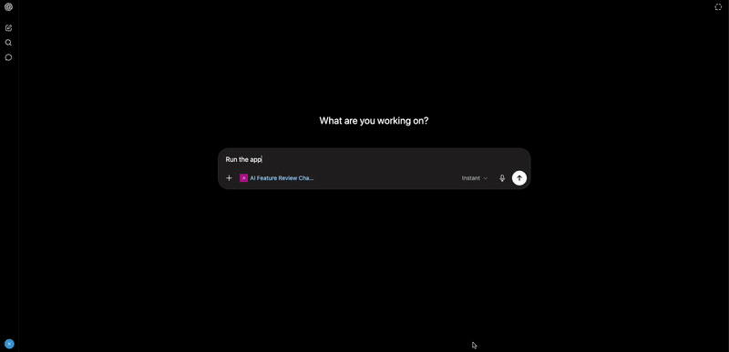
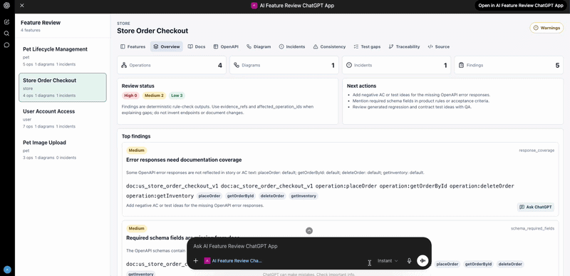
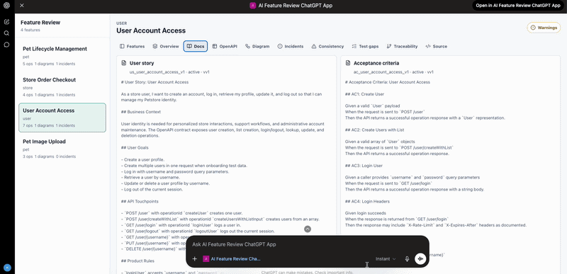
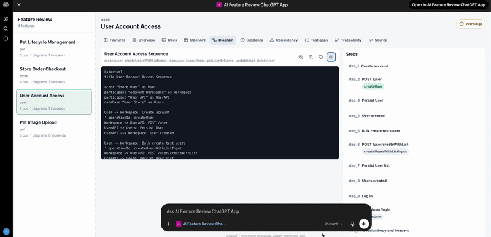
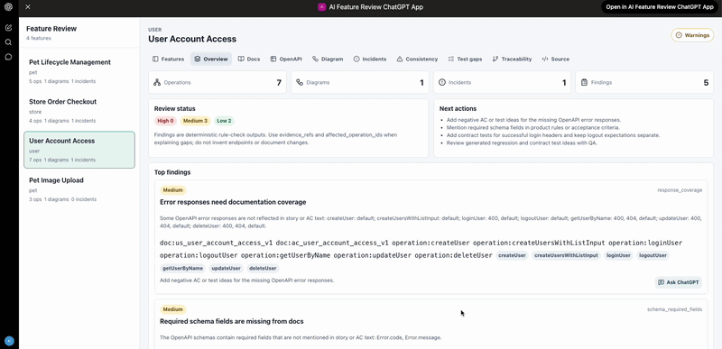
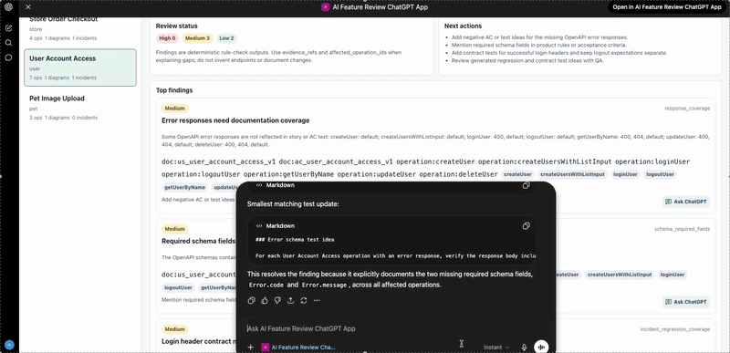

# AI Feature Review ChatGPT App

Many teams want AI inside their products, but embedding a full AI layer into an existing application can be expensive: new backend orchestration, model governance, UI patterns, authentication boundaries, evaluation, observability, and ongoing maintenance all add up quickly.

This project explores a lighter product pattern: build the application around an AI host instead of forcing AI deep into the application stack. OpenAI's ChatGPT Apps SDK makes that possible by letting a product expose tools, structured data, and a custom interface directly inside ChatGPT. The app keeps ChatGPT as the reasoning layer while the product backend stays deterministic, compact, and easier to evaluate.

In this demo, that pattern is applied to feature review. The app is a read-only ChatGPT App for reviewing feature documentation against OpenAPI slices, PlantUML feature-flow diagrams, incident notes, and deterministic consistency checks.

The app is built for portfolio/demo use on the synthetic Swagger Petstore product-doc dataset in `docs/raw_data`. It does not call a backend AI model. ChatGPT is the reasoning layer; the MCP/backend layer only loads, slices, renders, and checks deterministic data.

## Why This Pattern

- Lower integration cost: no separate AI orchestration backend is needed for the MVP.
- Faster UX surface: the review workspace runs inside ChatGPT, where the user is already asking questions.
- Clearer responsibility split: ChatGPT reasons; MCP/backend retrieves and validates deterministic context.
- Safer iteration: all MVP tools are read-only and evidence-backed.
- Smaller model context: only feature-specific OpenAPI slices and compact structured outputs are sent to ChatGPT.

## What It Shows

- A compact inline launcher in ChatGPT, with a fullscreen Feature Review Workspace.
- Feature summaries from `docs/raw_data/synthetic_product_docs/manifest.json`.
- User story, acceptance criteria, incident notes, related OpenAPI operations, related schemas, and PlantUML diagrams for one feature.
- OpenAPI operation-level slices instead of sending the full `openapi.yaml`.
- SVG feature-flow diagrams generated from PlantUML `.puml` source.
- Deterministic findings with evidence references and suggested next actions.
- Chat-first prompts where ChatGPT calls read-only tools and explains the gaps.


### Demo 1: Inline Launcher and Fullscreen Workspace



### Demo 2: Feature Overview



### Demo 3: Diagram To Operation Linking



### Demo 4: OpenAPI Slice



### Demo 5: Finding Follow-Up



### Demo 6: QA Gap Report



## Demo Prompts

Use these in ChatGPT Developer Mode after connecting the MCP endpoint:

```text
Review Pet Lifecycle Management. Do the user story, acceptance criteria, and OpenAPI slice match?
```

```text
What is wrong around findPetsByStatus?
```

```text
What does the Pet Status Filter Mismatch incident tell us about missing tests?
```

```text
Create a QA gap report for Store Order Checkout.
```

```text
Show the flow diagram for Pet Lifecycle Management and explain which API operations appear on it.
```

## Architecture

```text
ChatGPT conversation
  -> MCP server (Apps SDK HTTP transport)
      -> review-service (FastAPI)
          -> synthetic product docs
          -> OpenAPI parser/slicer
          -> PlantUML parser/renderer
          -> deterministic checks
  -> widget iframe (Feature Review Workspace)
```

Key boundaries:

- ChatGPT explains findings and answers follow-up questions.
- MCP tools expose read-only structured data and widget resources.
- Review service parses raw data and returns deterministic context.
- Widget renders navigation, diagrams, tables, findings, and evidence.

See [docs/architecture.md](docs/architecture.md) for the detailed flow.

## Repository Layout

```text
apps/
  mcp-server/        TypeScript MCP server and Apps SDK widget resource
  widget/            React/Vite Feature Review Workspace
services/
  review-service/    FastAPI deterministic review backend
docs/
  raw_data/          OpenAPI spec and synthetic product documentation
  assets/demo/       GIF slots for portfolio demos
```

## Local Setup

Prerequisites:

- Node.js with Corepack.
- `pnpm` via `corepack`.
- Python 3.12+.
- `uv`.
- A tunnel tool such as `cloudflared` or `ngrok` for ChatGPT Developer Mode.

Install JavaScript dependencies:

```bash
corepack enable
corepack pnpm install
```

Install Python dependencies:

```bash
cd services/review-service
uv sync
```

Build the widget bundle used by the MCP resource:

```bash
corepack pnpm --filter widget build
```

Start the review service:

```bash
cd services/review-service
uv run uvicorn feature_review.api.main:app --host 127.0.0.1 --port 8000
```

Start the MCP server:

```bash
PUBLIC_BASE_URL=https://<your-public-tunnel-host> \
REVIEW_SERVICE_URL=http://127.0.0.1:8000 \
corepack pnpm --filter mcp-server dev
```

Expose the MCP server:

```bash
cloudflared tunnel --url http://127.0.0.1:2091
```

Connect ChatGPT Developer Mode to:

```text
https://<your-public-tunnel-host>/mcp
```

After widget HTML/CSS/JS changes, rebuild the widget, bump the widget URI, restart the MCP server, and refresh app metadata in ChatGPT.

## Local Widget UI

For standalone UI work without ChatGPT:

```bash
corepack pnpm --filter widget dev
```

Open:

```text
http://127.0.0.1:5173/
```

Standalone local mode loads `apps/widget/src/dev/mock_tool_result.json` and routes widget tool calls to a local fixture.

## Tests

Run all JavaScript tests:

```bash
corepack pnpm test
```

Run backend tests:

```bash
cd services/review-service
uv run pytest
```

Useful smoke checks:

```bash
curl http://127.0.0.1:8000/health
curl http://127.0.0.1:8000/features
curl http://127.0.0.1:2091/health
```

## Documentation

- [Architecture](docs/architecture.md)
- [OpenAPI slicing strategy](docs/openapi_slicing_strategy.md)
- [Diagram rendering strategy](docs/diagram_rendering_strategy.md)
- [Feature review examples](docs/feature_review_examples.md)
- [Evaluation methodology](docs/eval_methodology.md)

## Limitations

- MVP is read-only. It does not mutate source docs, create PRs, or write back to GitHub.
- Backend has no AI/LangChain/LangGraph layer.
- The dataset is synthetic and intentionally small.
- The OpenAPI slicer returns feature-specific operation slices, not the full spec.
- Quick tunnel URLs are ephemeral unless you configure a stable tunnel/domain.
- Widget fullscreen behavior depends on the ChatGPT Apps host supporting `window.openai.requestDisplayMode`.


