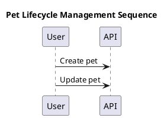

# Diagram Rendering Strategy

PlantUML diagrams are source artifacts, not decorative screenshots. The app parses them, maps steps to OpenAPI operation IDs, and renders SVG for the widget.

## Source Format

Diagrams live in:

```text
docs/raw_data/synthetic_product_docs/diagrams/
```

Each diagram is a PlantUML sequence diagram with operation markers:



Operation markers are comments so the diagram remains valid PlantUML.

## Pipeline

```text
.puml source
  -> diagram_loader.py
  -> plantuml_parser.py
  -> step_mapper.py
  -> renderer.py
  -> FeatureDiagram.rendered_svg
  -> Widget Diagram view
```

## Parsed Fields

The backend preserves:

- diagram ID;
- feature ID;
- title;
- diagram type;
- raw PlantUML source;
- rendered SVG;
- related operation IDs;
- steps;
- source line numbers where available.

## Step To Operation Mapping

`step_mapper.py` connects parsed steps to nearby `operationId` markers. The widget uses this mapping so a user can click a diagram step and highlight the related OpenAPI operation.

## Rendering

The renderer attempts to produce SVG for widget display. The current implementation supports cached SVG and a deterministic fallback SVG renderer for local/portfolio demos where a PlantUML server or Java runtime is not available.

The fallback renderer creates a sequence-style SVG with:

- participant boxes;
- lifelines;
- arrows;
- operation chips;
- readable labels.

## Widget Interactions

The Diagram tab supports:

- rendered SVG display;
- pan/zoom controls;
- source toggle;
- step list;
- operation selection;
- evidence links back to findings.

## Cache Invalidation

Rendered SVG cache entries should be invalidated when:

- source `.puml` changes;
- fallback renderer version changes;
- rendering strategy changes materially.

## Validation Checks

Useful tests:

- diagrams in manifest exist on disk;
- parser extracts title and operation markers;
- step mapping preserves operation IDs;
- renderer returns non-empty SVG;
- old fallback SVG output is not reused after renderer changes;
- widget can render SVG without script/event handlers.
